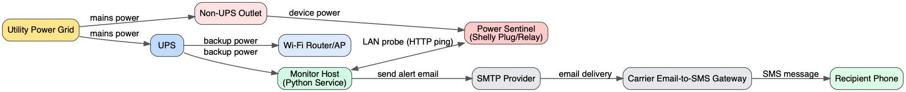
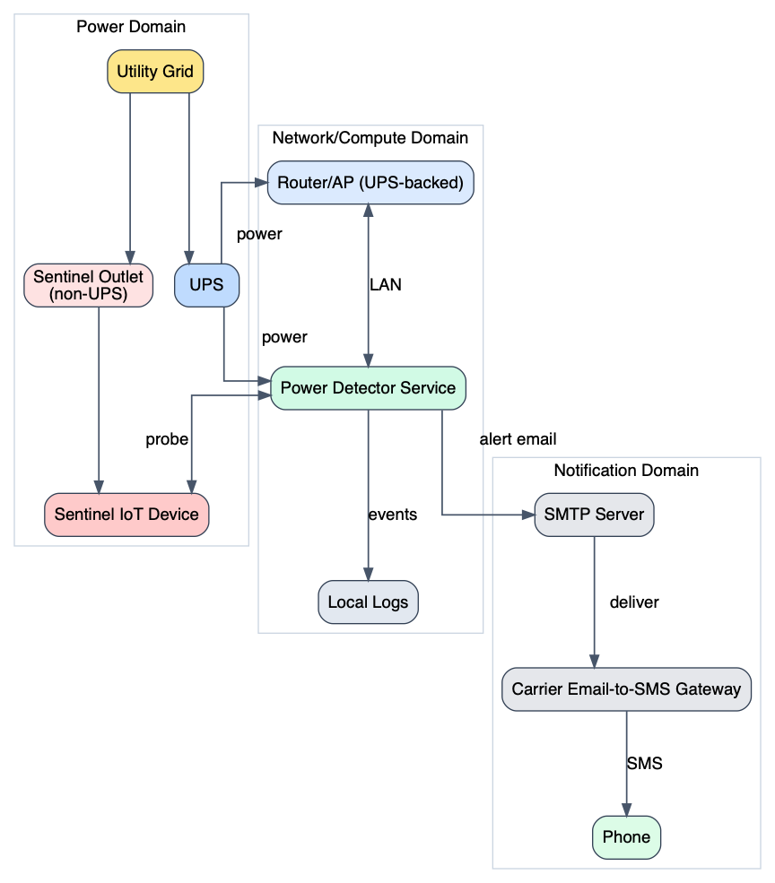

# Power Detector Plan

Last updated: 2026-03-05

## Goal

Detect home power loss and send an SMS alert when outage duration exceeds 60 seconds.

## Constraints and Assumptions

1. Standalone application.
2. Zero recurring cost to execute and deploy.
3. Cloud usage is allowed only if still zero cost.
4. Home has IoT devices from Shelly/FEIT and others.
5. Home has Alexa available.
6. Wi-Fi infrastructure is UPS-backed and remains available for some time during outage.

## Evaluated Approaches

### Option A: Cloud-only IoT Platform Rules

Use vendor cloud automations/webhooks to detect device offline state and trigger SMS.

Pros:
- Minimal local code.
- Quick setup if supported by vendor.

Cons:
- Offline detection latency/control is often limited.
- Hard to guarantee alert threshold exactly at >60 seconds.
- SMS commonly requires paid third-party provider.
- Vendor lock-in and service behavior changes.

### Option B: Home Assistant Automation

Use Home Assistant state tracking plus automation actions for alerts.

Pros:
- Strong integration ecosystem.
- Good observability and UI.

Cons:
- Additional platform to operate.
- Can drift from "standalone app" requirement.
- SMS still needs transport path (often paid unless email-to-SMS).

### Option C: Python Watchdog on UPS-backed Host (Recommended)

Run a local Python service that checks a dedicated non-UPS power-sentinel IoT device and sends SMS using a free email-to-SMS gateway.

Pros:
- Deterministic outage timer and logic.
- Fully standalone and testable codebase.
- Zero recurring cost possible.
- Works with mixed-vendor homes by abstracting device checks.

Cons:
- Requires one always-on host.
- SMS delivery depends on carrier gateway reliability.

## Recommendation

Proceed with Option C for MVP:

1. Use one Shelly device on non-UPS power as the power sentinel.
2. Poll sentinel every 5 seconds.
3. If sentinel unreachable/offline continuously for >60 seconds, send outage SMS.
4. Send one recovery SMS when sentinel becomes reachable again.
5. De-duplicate notifications to prevent message storms.

## Runtime and Deployment

### Runtime Location

- Host: UPS-backed machine on local network (Linux preferred first target).
- Network: same LAN as IoT sentinel device.
- Process model: long-running Python service.

### Deployment Model

1. Clone repository on host.
2. Create Python virtual environment.
3. Install dependencies from `requirements.txt`.
4. Configure environment variables or config file (device IPs, recipients, SMTP settings).
5. Run as background service:
- Linux: `systemd` unit.
- macOS: `launchd`.
- Windows: Task Scheduler or NSSM service.

### Zero-Cost SMS Path

- Send alert email via SMTP to carrier gateway address (for example `5551234567@vtext.com`).
- No paid API required.
- Requires target carrier domain and a sender SMTP account.

## High-Level Data Flow

1. Monitor polls sentinel.
2. Missed polls accumulate outage duration.
3. At 60-second threshold, monitor emits outage alert.
4. On restored reachability, monitor emits recovery alert.
5. All events are logged locally for audit/debug.

## Architecture Diagram

Source: `docs/diagrams/architecture.dot`

## Interconnection Diagram

Source: `docs/diagrams/interconnection.dot`

## Implementation Plan (After Approval)

1. Create `power_detector.py` following `template.py` style exactly.
2. Implement device check abstraction (start with Shelly HTTP probe).
3. Implement outage state machine (`normal -> outage_pending -> outage_alerted -> recovered`).
4. Implement SMTP email-to-SMS notifier with retry and timeout.
5. Add config loader and validation.
6. Add CLI flags (`--verbose`, `--quiet`, plus config path).
7. Add tests for outage timing/de-duplication logic.
8. Add service install docs and quick-start script.

## Open Items Requiring Confirmation

1. Target OS for first deployment.
2. Carrier gateway details for recipient SMS.
3. Final list of sentinel devices (single vs multi-device quorum).
4. Whether WAN-loss should trigger separate alerts.
